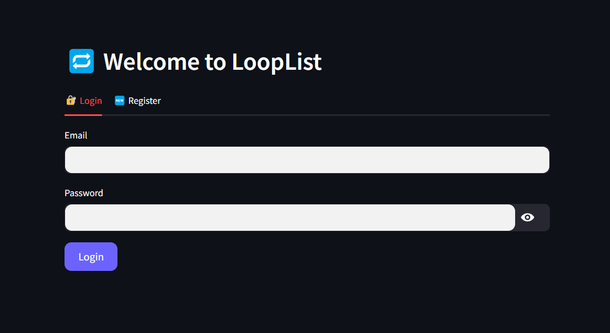

# 🔁 LoopList

LoopList is a minimalist, real-time collaborative to-do list app built with **Streamlit** and **Firebase**. Designed for Gen Z productivity, it lets users add, delete, and manage their tasks with secure email login.

---

## 🚀 Features

- 🔐 Firebase Authentication (email & password)
- ☁️ Real-time database with Firebase Realtime DB
- ✅ Add & delete tasks instantly
- 🌐 Built using Streamlit for a fast web interface

---

## 📸 Screenshot

  
<sub>*Add your actual app screenshot in the `assets` folder and rename it accordingly.*</sub>

---

## 🔧 Setup Instructions

### 1. Clone the Repository
```bash
git clone https://github.com/your-username/LoopList.git
cd LoopList
